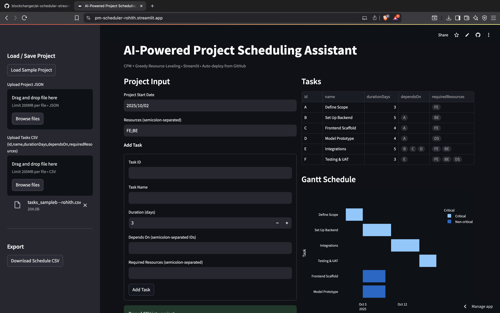

Compute the **Critical Path** and generate **resource-constrained schedules** from a simple task list. Visualize timelines as an interactive **Gantt chart**, import from **CSV/JSON**, and export the final schedule.

**Live demo:** https://pm-scheduler-rohith.streamlit.app  
**Code:** https://github.com/blockchanger/ai-scheduler-streamlit



## ✨ Features
- Critical Path Method (ES/EF, LS/LF, slack, critical tasks)
- Resource-constrained scheduling (greedy leveling)
- Interactive Gantt (Plotly)
- Import CSV/JSON, export schedule CSV
- Auto-deploy from GitHub via Streamlit Cloud

## 🚀 Run locally
```bash
pip install -r requirements.txt
streamlit run app.py
